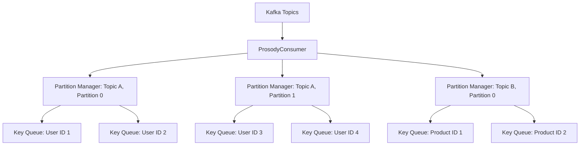
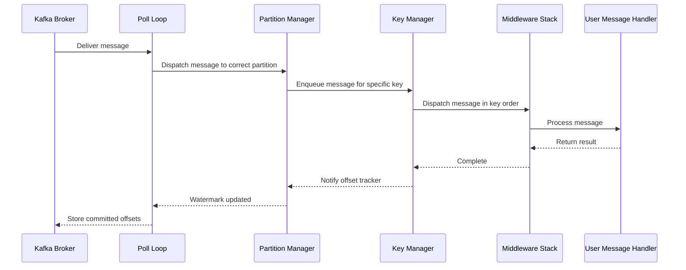

# Architecture

Prosody is designed to provide efficient and parallel processing of Kafka messages while maintaining order for messages
with the same key. Here's an overview of its architecture:

## Consumer Architecture

The consumer in Prosody is built around the concept of partition-level parallelism and key-based ordering.

1. **Partition-Level Parallelism**: Each Kafka partition is managed by a separate `PartitionManager`. This allows for
   parallel processing of messages from different partitions. The `PartitionManager` is responsible for buffering
   messages and tracking offsets for its assigned partition.

2. **Key-Based Queuing**: Within each partition, messages are further divided based on their keys. Each unique key
   within a partition has its own queue. This ensures that messages with the same key are processed in order.

3. **Concurrent Processing**: Different keys can be processed concurrently, even within the same partition, allowing for
   high throughput. The `PartitionManager` can process messages from different key queues simultaneously.

4. **Ordered Processing**: Messages with the same key are processed sequentially from their respective queue, ensuring
   ordered processing for each key.

5. **Polling Mechanism**: The `KafkaConsumer` uses a polling mechanism to efficiently fetch messages from Kafka brokers.

6. **Backpressure Management**: Prosody provides multiple levels of backpressure control:
    - **Global buffering**: A global semaphore limits the total number of messages being processed across all partitions
    - **Partition pausing**: If a partition becomes backed up (i.e., its queues are full), Prosody will pause
      consumption from that specific partition. Other partitions continue to make progress, ensuring that a slowdown in
      one partition doesn't affect the entire consumer
    - **Per-key queuing**: Each key has its own queue to preserve message order; the global semaphore prevents unbounded
      growth by pausing consumption when the in-flight count reaches `PROSODY_MAX_UNCOMMITTED`

## Message Flow

1. The `Poll Loop` polls messages from Kafka Brokers on behalf of `ProsodyConsumer`.
2. Messages are dispatched to the appropriate `PartitionManager` based on their topic and partition.
3. The `PartitionManager` enqueues the message in the correct key-based queue within `KeyManager`, according to the
   message key (e.g., User ID, Product ID).
4. `KeyManager` dispatches messages for each key sequentially through the middleware stack, which applies retry,
   deduplication, telemetry, timeout, cancellation, and other behaviors before invoking the user-provided `EventHandler`.
5. After processing, the key's offset is recorded in `OffsetTracker`.
6. The `PartitionManager`'s `OffsetTracker` tracks the partition's high watermark committed offset.
7. The `Poll Loop` reads watermarks from each `PartitionManager` and stores them with librdkafka, which commits them
   back to Kafka asynchronously, ensuring at-least-once message processing semantics.
8. If a partition's queues become full, that specific partition is paused until the backlog is processed.

Throughout this flow, OpenTelemetry is used to create and propagate distributed traces, allowing for end-to-end
visibility of message processing across different services.

### Span Linking

By default, message execution spans use **`child`** (child-of relationship — the execution span is part of
the same trace as the producer). Timer execution spans use **`follows_from`** (the execution span starts a
new trace with a span link back to the scheduling span, since timer execution is causally related but not part of
the same operation).

Both strategies are configurable via `PROSODY_MESSAGE_SPANS` and `PROSODY_TIMER_SPANS` (or the builder fields
`message_spans` and `timer_spans`). Accepted values: `child`, `follows_from`.

This architecture allows Prosody to achieve high throughput by processing different partitions and keys concurrently,
while still maintaining strict ordering for messages with the same key. It also provides backpressure management by
limiting the total number of in-flight messages across all keys within a partition through a global semaphore and
selective partition pausing.

## Component Organization

```mermaid
flowchart TD
    classDef subgraphStyle fill:#f5f5f5,stroke:#666

    HLC["<a href='https://github.com/prosody-events/prosody/tree/main/src/high_level/mod.rs'>HighLevelClient</a>"]
    HLC --> Producer["<a href='https://github.com/prosody-events/prosody/tree/main/src/producer/mod.rs'>ProsodyProducer</a>"]
    HLC --> ConsumerMain["<a href='https://github.com/prosody-events/prosody/tree/main/src/consumer/mod.rs'>ProsodyConsumer</a>"]

    subgraph ProducerComponents["Producer Components"]
        Producer --> KafkaProducer["<a href='https://github.com/prosody-events/prosody/tree/main/src/producer/mod.rs'>Kafka Producer</a>"]
        Producer --> ICache["<a href='https://github.com/prosody-events/prosody/tree/main/src/producer/mod.rs'>Idempotence Cache</a>"]
        Producer --> PropP["<a href='https://github.com/prosody-events/prosody/tree/main/src/propagator.rs'>OpenTelemetry Propagator</a>"]
    end

    subgraph ConsumerComponents["Consumer Components"]
        ConsumerMain --> Context["<a href='https://github.com/prosody-events/prosody/tree/main/src/consumer/kafka_context.rs'>Kafka Context</a>"]
        ConsumerMain --> PollLoop["<a href='https://github.com/prosody-events/prosody/tree/main/src/consumer/poll.rs'>Poll Loop</a>"]
        ConsumerMain --> ProbeServer["<a href='https://github.com/prosody-events/prosody/tree/main/src/consumer/probes.rs'>Probe Server</a>"]
        Context --> PMgr
        PollLoop --> PMgr
    end

    subgraph PartitionComponents["Partition Processing"]
        PMgr["<a href='https://github.com/prosody-events/prosody/tree/main/src/consumer/partition/mod.rs'>Partition Manager</a>"]
        PMgr --> KeyMgr["<a href='https://github.com/prosody-events/prosody/tree/main/src/consumer/partition/keyed/mod.rs'>Key Manager</a>"]
        PMgr --> OTracker["<a href='https://github.com/prosody-events/prosody/tree/main/src/consumer/partition/offsets/mod.rs'>Offset Tracker</a>"]
        KeyMgr --> EHandler["<a href='https://github.com/prosody-events/prosody/tree/main/src/consumer/mod.rs'>Event Handler</a>"]
    end

    subgraph MiddlewareHandling["Middleware Components"]
        RetryS["<a href='https://github.com/prosody-events/prosody/tree/main/src/consumer/middleware/retry.rs'>Retry Middleware</a>"]
        DedupS["<a href='https://github.com/prosody-events/prosody/tree/main/src/consumer/middleware/deduplication/mod.rs'>Deduplication Middleware</a>"]
        DeferS["<a href='https://github.com/prosody-events/prosody/tree/main/src/consumer/middleware/defer/mod.rs'>Defer Middleware</a>"]
        MonoS["<a href='https://github.com/prosody-events/prosody/tree/main/src/consumer/middleware/monopolization.rs'>Monopolization Middleware</a>"]
        SchedS["<a href='https://github.com/prosody-events/prosody/tree/main/src/consumer/middleware/scheduler/mod.rs'>Scheduler Middleware</a>"]
        TelS["<a href='https://github.com/prosody-events/prosody/tree/main/src/consumer/middleware/telemetry.rs'>Telemetry Middleware</a>"]
        LogS["<a href='https://github.com/prosody-events/prosody/tree/main/src/consumer/middleware/log.rs'>Log Middleware</a>"]
        TimeoutS["<a href='https://github.com/prosody-events/prosody/tree/main/src/consumer/middleware/timeout.rs'>Timeout Middleware</a>"]
        CancelS["<a href='https://github.com/prosody-events/prosody/tree/main/src/consumer/middleware/cancellation.rs'>Cancellation Middleware</a>"]
        TopicS["<a href='https://github.com/prosody-events/prosody/tree/main/src/consumer/middleware/topic.rs'>Failure Topic Middleware</a>"]
    end

    KeyMgr -.-> MiddlewareHandling
    TopicS --> FTopic["Failure Topic"]
    Producer --> FTopic

    subgraph TracingSystem["OpenTelemetry Integration"]
        OTel["<a href='https://github.com/prosody-events/prosody/tree/main/src/telemetry/mod.rs'>Telemetry</a>"]
        Prop["<a href='https://github.com/prosody-events/prosody/tree/main/src/propagator.rs'>Propagator</a>"]
        MExtract["<a href='https://github.com/prosody-events/prosody/tree/main/src/consumer/extractor.rs'>Message Extractor</a>"]
        RInject["<a href='https://github.com/prosody-events/prosody/tree/main/src/producer/injector.rs'>Record Injector</a>"]
        OTel --> Prop
        Prop --> MExtract
        Prop --> RInject
    end

    ConsumerMain -.-> OTel
    Producer -.-> OTel

    class ProducerComponents,ConsumerComponents,PartitionComponents,MiddlewareHandling,TracingSystem subgraphStyle
```

