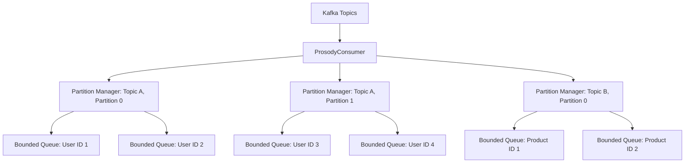
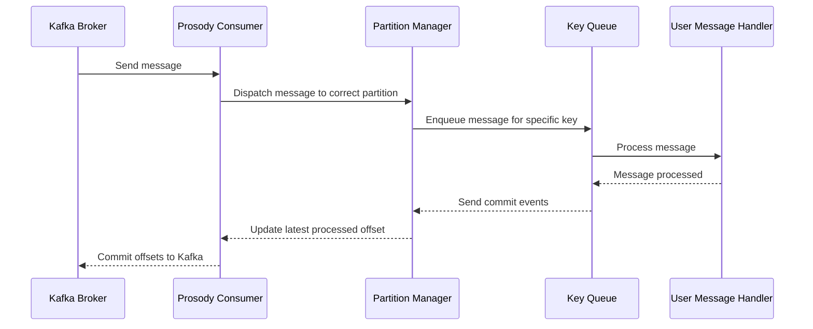

# Prosody

Prosody is a high-level Kafka client library for Rust, featuring robust consumer and producer implementations with
integrated OpenTelemetry support for distributed tracing.

[](https://studious-enigma-6k896qq.pages.github.io/prosody)
[](https://github.com/cincpro/prosody/actions/workflows/general.yaml?query=branch%3Amain)
[](https://github.com/cincpro/prosody/actions/workflows/documentation.yaml?query=branch%3Amain)
[](https://github.com/cincpro/prosody/actions/workflows/quality.yaml?query=branch%3Amain)
[](https://github.com/cincpro/prosody/actions/workflows/coverage.yaml?query=branch%3Amain)


## Features

- **Kafka Consumer**: Efficiently consume messages with support for offset management and consumer groups.
- **Kafka Producer**: Reliably produce messages with idempotent delivery.
- **Timer System**: Distributed scheduling with persistent storage backends (Cassandra, memory).
- **Distributed Tracing**: Seamless integration with OpenTelemetry for enhanced observability in microservice
  architectures.
- **Configurable**: Flexible configuration through environment variables.
- **Asynchronous**: Built on top of Tokio for high-performance asynchronous operations.
- **Backpressure Management**: Intelligent partition pausing to handle processing backlogs.
- **Mocking Support**: Ability to use mock Kafka brokers for testing purposes.
- **High-Level Client**: Unified management of producer and consumer operations.
- **Failure Handling**: Configurable strategies for handling message processing failures.

## Usage

Add Prosody to your `Cargo.toml`:

```toml
[dependencies]
prosody = { git = "https://github.com/cincpro/prosody.git" }
```

### High-Level Client Example

```rust
use prosody::consumer::ConsumerConfiguration;
use prosody::consumer::failure::retry::RetryConfiguration;
use prosody::consumer::failure::topic::FailureTopicConfigurationBuilder;
use prosody::consumer::failure::{FallibleHandler, ClassifyError};
use prosody::consumer::message::ConsumerMessage;
use prosody::consumer::event_context::EventContext;
use prosody::timers::{Trigger, store::TriggerStore};
use prosody::timers::store::cassandra::CassandraConfigurationBuilder;
use prosody::high_level::mode::Mode;
use prosody::high_level::{HighLevelClient};
use prosody::producer::ProducerConfiguration;
use serde_json::json;
use std::convert::Infallible;
use std::error::Error;

#[derive(Clone)]
struct MyHandler;

impl FallibleHandler for MyHandler {
    type Error = Infallible;

    async fn on_message<C>(
        &self,
        context: C,
        message: ConsumerMessage
    ) -> Result<(), Self::Error>
    where
        C: EventContext,
    {
        println!("Received: {message:?}");
        Ok(())
    }

    async fn on_timer<C>(
        &self,
        context: C,
        trigger: Trigger,
    ) -> Result<(), Self::Error>
    where
        C: EventContext,
    {
        println!("Timer triggered: {trigger:?}");
        Ok(())
    }
}

#[tokio::main]
async fn main() -> Result<(), Box<dyn std::error::Error>> {
    let bootstrap_servers = ["localhost:9092".to_owned()];

    // The group identifier is the name of your Kafka consumer group. It should be set to the name of your application.
    let mut consumer_config = ConsumerConfiguration::builder();
    consumer_config.bootstrap_servers(bootstrap_servers)
        .group_id("my-group")
        .subscribed_topics(["my-topic".to_owned()]);


    // To allow loopbacks, the source_system must be different from the group_id.
    // Normally, the source_system would be left unspecified and would default to the group_id if a consumer is 
    // configured.
    let mut producer_config = ProducerConfiguration::builder();
    producer_config
        .bootstrap_servers(bootstrap_servers.clone())
        .source_system("my-source");

    let retry_config = RetryConfiguration::builder();
    let cassandra_config = CassandraConfigurationBuilder::default();

    let client = HighLevelClient::new(
        Mode::Pipeline,
        &mut producer_config,
        &consumer_config,
        &retry_config,
        &FailureTopicConfigurationBuilder::default(),
        &cassandra_config,
    )?;

    client.subscribe(MyHandler).await?;

    let topic = "my-topic".into();
    client.send(topic, "message-key", &json!({"value": "Hello, Kafka!"})).await?;

    // Run your application logic here

    client.unsubscribe().await?;
    Ok(())
}
```

## High-Level Client Modes

Prosody's `HighLevelClient` supports two operational modes:

### Pipeline Mode

Designed for applications that require all messages to be processed or sent in order. Pipeline mode implements
**Quality of Service (QoS)** mechanisms that maintain throughput under adverse conditions while preserving per-key
ordering guarantees.

**The Problem:** A Kafka partition processes messages in order. When one key fails repeatedly or takes too long, it
blocks everything behind it. A single problematic key can halt an entire partition.

**The Solution:** Three mechanisms work together:

1. **Fair Scheduling** - Keys compete for execution slots based on accumulated runtime. Heavy keys get deprioritized;
   starving keys get priority boosts.

2. **Deferred Retry** - Persistently failing keys move to timer-based retry. The partition continues processing other
   keys while failures retry in the background.

3. **Monopolization Detection** - Keys consuming excessive execution time are rejected, forcing them through the defer
   path.

Messages flow through a middleware stack where each layer handles a specific concern:

```
Kafka → Retry → Defer → Monopolization → Shutdown → Scheduler → Timeout → Telemetry → Handler
```

| Layer          | Purpose                                                  |
|----------------|----------------------------------------------------------|
| Retry          | Infinite retry on transient errors                       |
| Defer          | Persistent retry via timers, releases partition on fail  |
| Monopolization | Rejects keys consuming >90% of execution window          |
| Shutdown       | Handles graceful partition revocation                    |
| Scheduler      | Fair permit acquisition with virtual-time priority       |
| Timeout        | Cancels handlers exceeding deadline                      |
| Telemetry      | Records handler lifecycle events                         |

Pipeline mode ensures:

- Ordered handling of all messages
- Indefinite retries for failed operations based on the retry configuration
- Ideal for pipeline applications where order is crucial

### Low-Latency Mode

Optimized for applications prioritizing quick processing or sending, tolerating occasional message failures. It
features:

- Low-latency operations
- A retry mechanism for failed operations
- For consumers: Sends persistently failing messages to a failure topic
- For producers: Returns an error after a configurable number of retries
- Ideal for applications where speed is crucial and failed messages can be handled separately

### Best-Effort Mode

Designed for development environments or services where message processing failures are acceptable. It features:

- Simple error logging without retries
- Failed messages are logged and discarded
- For consumers: Failed messages are logged and committed
- For producers: Returns an error after configured timeout
- Ideal for:
    - Development and testing environments
    - Services that can tolerate message loss
    - Applications where retrying failed messages is not critical

## Configuration

Prosody can be configured through environment variables or programmatically using the builder pattern. Both
`ConsumerConfiguration` and `ProducerConfiguration` use this approach. The builder pattern automatically falls back to
environment variables for any unspecified field. This means you can mix and match programmatic configuration with
environment variables, giving you flexibility in how you set up your Kafka clients.

The following tables list available environment variables by category:

### Core

| Environment Variable        | Description                                        | Default      | Consumer | Producer |
|-----------------------------|----------------------------------------------------|--------------|----------|----------|
| `PROSODY_BOOTSTRAP_SERVERS` | Kafka servers to connect to                        | -            | ✓        | ✓        |
| `PROSODY_GROUP_ID`          | Consumer group name                                | -            | ✓        |          |
| `PROSODY_SUBSCRIBED_TOPICS` | Topics to read from                                | -            | ✓        |          |
| `PROSODY_ALLOWED_EVENTS`    | Only process events matching these prefixes        | (all)        | ✓        |          |
| `PROSODY_SOURCE_SYSTEM`     | Tag for outgoing messages (prevents reprocessing)  | `<group id>` |          | ✓        |
| `PROSODY_MOCK`              | Use in-memory Kafka for testing                    | false        | ✓        | ✓        |
| `PROSODY_LOG`               | Log level (e.g., `info`, `prosody=debug`)          | info         | ✓        | ✓        |

### Consumer

| Environment Variable             | Description                                          | Default                |
|----------------------------------|------------------------------------------------------|------------------------|
| `PROSODY_MAX_CONCURRENCY`        | Max messages being processed simultaneously          | 32                     |
| `PROSODY_MAX_UNCOMMITTED`        | Max queued messages before pausing consumption       | 64                     |
| `PROSODY_MAX_ENQUEUED_PER_KEY`   | Max queued messages per key before pausing           | 8                      |
| `PROSODY_TIMEOUT`                | Cancel handler if it runs longer than this           | 80% of stall threshold |
| `PROSODY_COMMIT_INTERVAL`        | How often to save progress to Kafka                  | 1s                     |
| `PROSODY_POLL_INTERVAL`          | How often to fetch new messages from Kafka           | 100ms                  |
| `PROSODY_SHUTDOWN_TIMEOUT`       | Wait this long for in-flight work before force-quit  | 30s                    |
| `PROSODY_STALL_THRESHOLD`        | Report unhealthy if no progress for this long        | 5m                     |
| `PROSODY_PROBE_PORT`             | HTTP port for health checks ('none' to disable)      | 8000                   |
| `PROSODY_FAILURE_TOPIC`          | Send unprocessable messages here (dead letter queue) | -                      |
| `PROSODY_IDEMPOTENCE_CACHE_SIZE` | Track this many message IDs to skip duplicates       | 4096                   |
| `PROSODY_SLAB_SIZE`              | Timer storage granularity (rarely needs changing)    | 1h                     |

### Producer

| Environment Variable   | Description                     | Default |
|------------------------|---------------------------------|---------|
| `PROSODY_SEND_TIMEOUT` | Give up sending after this long | 1s      |

### Retry

When a handler fails, retry with exponential backoff:

| Environment Variable      | Description                      | Default |
|---------------------------|----------------------------------|---------|
| `PROSODY_MAX_RETRIES`     | Give up after this many attempts | 3       |
| `PROSODY_RETRY_BASE`      | Wait this long before first retry | 20ms    |
| `PROSODY_RETRY_MAX_DELAY` | Never wait longer than this      | 5m      |

### Deferral

When a key keeps failing (e.g., downstream is down), stop retrying immediately
and schedule retries for much later. This prevents one broken dependency from
blocking all processing.

**How it works:** On transient failure, defer middleware stores the message offset in Cassandra, schedules a timer, and
returns success—freeing the partition to process other keys. When the timer fires, the message is reloaded from Kafka
and retried.

**Failure Rate Gating:** When the global failure rate exceeds the threshold (default: 90%), deferral is disabled. Errors
propagate to retry middleware which retries forever, intentionally blocking the partition to provide backpressure during
total downstream failure.

| Environment Variable              | Description                                       | Default |
|-----------------------------------|---------------------------------------------------|---------|
| `PROSODY_DEFER_ENABLED`           | Enable deferral for new messages                  | true    |
| `PROSODY_DEFER_BASE`              | Wait this long before first deferred retry        | 1s      |
| `PROSODY_DEFER_MAX_DELAY`         | Never wait longer than this                       | 24h     |
| `PROSODY_DEFER_FAILURE_THRESHOLD` | Disable deferral when failure rate exceeds this   | 0.9     |
| `PROSODY_DEFER_FAILURE_WINDOW`    | Measure failure rate over this time window        | 5m      |
| `PROSODY_DEFER_CACHE_SIZE`        | Track this many deferred keys in memory           | 1024    |
| `PROSODY_DEFER_SEEK_TIMEOUT`      | Timeout when loading deferred messages            | 30s     |
| `PROSODY_DEFER_DISCARD_THRESHOLD` | Read optimization (rarely needs changing)         | 100     |

### Cassandra

Persistent storage for scheduled retries (not needed if `PROSODY_MOCK=true`):

| Environment Variable           | Description                        | Default |
|--------------------------------|------------------------------------|---------|
| `PROSODY_CASSANDRA_NODES`      | Servers to connect to (host:port)  | -       |
| `PROSODY_CASSANDRA_KEYSPACE`   | Keyspace name                      | prosody |
| `PROSODY_CASSANDRA_USER`       | Username                           | -       |
| `PROSODY_CASSANDRA_PASSWORD`   | Password                           | -       |
| `PROSODY_CASSANDRA_DATACENTER` | Prefer this datacenter for queries | -       |
| `PROSODY_CASSANDRA_RACK`       | Prefer this rack for queries       | -       |
| `PROSODY_CASSANDRA_RETENTION`  | Delete data older than this        | 1y      |

### Hot Key Protection (Advanced)

If one key dominates processing (e.g., a single customer sending tons of events),
other keys get starved. This feature detects hot keys and temporarily slows them
down so other keys can make progress.

Example: With defaults, if key "customer-123" is processing for more than 4.5
minutes out of any 5-minute window, it gets throttled.

| Environment Variable                | Description                            | Default |
|-------------------------------------|----------------------------------------|---------|
| `PROSODY_MONOPOLIZATION_ENABLED`    | Enable hot key protection              | true    |
| `PROSODY_MONOPOLIZATION_THRESHOLD`  | Max handler time as fraction of window | 0.9     |
| `PROSODY_MONOPOLIZATION_WINDOW`     | Measurement window                     | 5m      |
| `PROSODY_MONOPOLIZATION_CACHE_SIZE` | Max distinct keys to track             | 8192    |

### Scheduler Tuning (Advanced)

Controls how the scheduler picks which message to process next using **virtual-time fairness**.

Each key accumulates "virtual time" equal to its execution duration. Keys with lower accumulated time get priority. To
prevent starvation, tasks waiting too long receive quadratic urgency boosts. Virtual times decay with a 120-second
half-life, so past monopolization doesn't permanently penalize a key.

Normal processing and failure retries have separate accounting (default: 70/30 split).

| Environment Variable               | Description                                                      | Default |
|------------------------------------|------------------------------------------------------------------|---------|
| `PROSODY_SCHEDULER_FAILURE_WEIGHT` | Fraction of processing time reserved for retries                 | 0.3     |
| `PROSODY_SCHEDULER_MAX_WAIT_SECS`  | Messages waiting this long get maximum priority                  | 2m      |
| `PROSODY_SCHEDULER_WAIT_WEIGHT`    | Priority boost for waiting messages (higher = more aggressive)   | 200.0   |
| `PROSODY_SCHEDULER_CACHE_SIZE`     | Max distinct keys to track                                       | 8192    |

### Topic Creation

For creating Kafka topics programmatically:

| Environment Variable               | Description                            | Default         |
|------------------------------------|----------------------------------------|-----------------|
| `PROSODY_TOPIC_NAME`               | Topic to create                        | -               |
| `PROSODY_TOPIC_PARTITIONS`         | Number of partitions                   | broker default  |
| `PROSODY_TOPIC_REPLICATION_FACTOR` | Number of replicas per partition       | broker default  |
| `PROSODY_TOPIC_RETENTION`          | Delete messages older than this        | cluster default |
| `PROSODY_TOPIC_CLEANUP_POLICY`     | Cleanup policy (delete, compact, both) | cluster default |

## Mock Mode for Testing

Prosody includes a mock mode that allows you to test your application without requiring a real Kafka cluster. This is
particularly useful for unit tests, integration tests, and local development.

### Enabling Mock Mode

To enable mock mode, set the `PROSODY_MOCK` environment variable to `true` or configure it programmatically. When using
mock mode, Prosody automatically creates topics in the mock cluster based on the `PROSODY_SUBSCRIBED_TOPICS` environment
variable. This ensures that consumers can subscribe to any topics they need without encountering "topic does not exist"
errors.

### Mock Mode Behavior

In mock mode:

- **Kafka Brokers**: Uses an in-memory mock Kafka cluster instead of real brokers
- **Timer Storage**: Uses in-memory storage instead of Cassandra
- **Topic Creation**: Automatically creates topics listed in `PROSODY_SUBSCRIBED_TOPICS`
- **Message Processing**: Full message processing pipeline works as in production
- **Networking**: No external network dependencies required

## Event Type Filtering

Prosody supports filtering messages based on exact event type prefixes, configured via `PROSODY_ALLOWED_EVENTS` or the
`ConsumerConfiguration` builder.

### Configuration

```sh
# Allow only events starting with exactly 'user.' or 'account.'
export PROSODY_ALLOWED_EVENTS=user.,account.
```

```rust,ignore
let config = ConsumerConfiguration::builder()
    .allowed_events(vec!["user.".to_owned()])
    .build()?;
```

### Matching Behavior

Prefixes must match exactly from the start of the event type:

✓ Matches:

- `{"type": "user.created"}` matches prefix `user.`
- `{"type": "account.deleted"}` matches prefix `account.`

✗ No Match:

- `{"type": "admin.user.created"}` doesn't match `user.`
- `{"type": "my.account.deleted"}` doesn't match `account.`
- `{"type": "notification"}` doesn't match any prefix

If no prefixes are configured, all messages are processed. Messages without a `type` field are always processed.

## Message Deduplication

Prosody prevents duplicate message processing using two mechanisms: **source system deduplication** and **idempotence
deduplication**.

### Source System Deduplication

Prosody introduces the `source-system` header to prevent processing loops caused by messages being reprocessed by the
same system that produced them:

- **Producers** add a `source-system` header to all outgoing messages.
- **Consumers** check incoming messages for the `source-system` header.
- If a message's `source-system` header matches the consumer group, the message is skipped.

This ensures that messages re-emitted by a consumer (e.g., for retry or forwarding purposes) do not create infinite
processing loops. If your application is doing both consumption and production, the source system will default to your
consumer group identifier. If your application is only producing messages and never configures a consumer, you will need
to set the source system. To explicitly set the producer's source system identifier, configure:

```sh
export PROSODY_SOURCE_SYSTEM="my-service"
```

### Idempotence Deduplication

Prosody also supports deduplication based on unique message identifiers. When a message contains an `id` field in its
JSON payload, Prosody tracks the last seen ID for each key within a partition. If the same ID appears again, the message
is considered a duplicate and is ignored.

This behavior is controlled by `PROSODY_IDEMPOTENCE_CACHE_SIZE`:

- Default: `4096` entries per partition and producer (~400KB memory per partition).
- Set to `0` to disable deduplication.
- Oldest entries are evicted when the cache reaches capacity.

This approach ensures exactly-once semantics within the limits of the configured cache size, reducing unnecessary
processing and network overhead.

## Liveness and Readiness Probes

Prosody includes a built-in probe server that provides health check endpoints for consumer-based applications. The probe
server is tied to the consumer's lifecycle and offers two main endpoints:

1. `/readyz`: A readiness probe that checks if any partitions are assigned to the consumer. It returns a success status
   only when the consumer has at least one partition assigned, indicating it's ready to process messages.
2. `/livez`: A liveness probe that checks if any partitions have stalled.

A partition is considered "stalled" if it has not processed a message within a specified time threshold. This threshold
is determined by the `PROSODY_STALL_THRESHOLD` configuration. By default, this is set to 5 minutes, but it
can be customized to suit your application's needs. If a partition is detected as stalled, the liveness probe will fail,
potentially triggering a restart of the application by the orchestration system.

To configure the probe server:

- Set the `PROSODY_PROBE_PORT` environment variable to a valid port number to enable the server. By default, it uses
  port 8000.
- To disable the probe server, set `PROSODY_PROBE_PORT` to 'none'.
- Adjust the `PROSODY_STALL_THRESHOLD` to change the stall detection threshold. For example, setting it to
  "30s" would consider a partition stalled if it hasn't processed a message in 30 seconds.
- If the probe server is enabled, it will start when the consumer is subscribed and stop when it is unsubscribed.

Note: It's important to set the `PROSODY_STALL_THRESHOLD` to a value that's appropriate for your application's
message processing latency. Setting it too low might result in false positives for stalled partitions, while setting it
too high could delay the detection of actual issues.

These endpoints can be integrated with container orchestration systems like Kubernetes to manage the lifecycle of your
application based on its health and readiness status. They provide valuable information about the consumer's state,
helping to ensure robust and responsive Kafka-based applications.

## Timer System

Prosody includes a distributed timer system that allows you to schedule events for future execution. The timer system
supports:

- **Persistent Storage**: Timers are stored in persistent backends (Cassandra or in-memory for testing)
- **Distributed Processing**: Multiple consumer instances can process timers from the same storage
- **Slab-Based Partitioning**: Timers are organized into time-based slabs for efficient retrieval
- **Automatic Cleanup**: Successfully processed timers are immediately deleted; failed timers expire after configurable
  period

### Timer Configuration

The timer system is automatically configured based on the consumer configuration:

- **Mock Mode**: Uses in-memory storage for testing (`PROSODY_MOCK=true`)
- **Production Mode**: Uses Cassandra for persistent storage
- **Slab Size**: Configure time-based partitioning with `PROSODY_SLAB_SIZE` (default: 1 hour)
- **Retention**: Retention period for timer and failure data via `PROSODY_CASSANDRA_RETENTION` (default: 1 year)

### Usage in Handlers

Your event handlers can receive timer events through the `on_timer` method of the `FallibleHandler` trait, as shown in
the example above.

## Common Project Tasks

Prosody uses a Makefile to simplify common development tasks. Here are some useful commands:

### Setup

- `make bootstrap`: Install Rust and necessary development tools.
- `make up`: Start Kafka and related services using Docker Compose.

### Development

- `make update`: Update project dependencies.
- `make format`: Format Rust code and TOML files.
- `make build`: Build the project.
- `make check`: Check for compilation errors without building.
- `make check-watch`: Watch for changes and check for compilation errors.
- `make lint`: Run Clippy for linting.
- `make lint-watch`: Watch for changes and run Clippy.

### Testing

- `make test`: Run tests (starts Kafka services first).
- `make test-watch`: Watch for changes and run tests.
- `make coverage`: Generate code coverage report.

### Maintenance

- `make dependencies`: Check for unused dependencies.
- `make reset`: Stop and remove Docker containers and volumes.

### Utilities

- `make console`: Open the Kafka console in a web browser.

## Architecture

Prosody is designed to provide efficient and parallel processing of Kafka messages while maintaining order for messages
with the same key. Here's an overview of its architecture:

### Consumer Architecture

The consumer in Prosody is built around the concept of partition-level parallelism and key-based ordering.



1. **Partition-Level Parallelism**: Each Kafka partition is managed by a separate `PartitionManager`. This allows for
   parallel processing of messages from different partitions. The `PartitionManager` is responsible for buffering
   messages and tracking offsets for its assigned partition.

2. **Key-Based Queuing**: Within each partition, messages are further divided based on their keys. Each unique key
   within a partition has its own bounded queue. This ensures that messages with the same key are processed in order.

3. **Concurrent Processing**: Different keys can be processed concurrently, even within the same partition, allowing for
   high throughput. The `PartitionManager` can process messages from different key queues simultaneously.

4. **Ordered Processing**: Messages with the same key are processed sequentially from their respective queue, ensuring
   ordered processing for each key.

5. **Polling Mechanism**: The `KafkaConsumer` uses a polling mechanism to efficiently fetch messages from Kafka brokers.

6. **Backpressure Management**: Prosody provides multiple levels of backpressure control:
    - **Global buffering**: A global semaphore limits the total number of messages being processed across all partitions
    - **Partition pausing**: If a partition becomes backed up (i.e., its queues are full), Prosody will pause
      consumption
      from that specific partition. Other partitions continue to make progress, ensuring that a slowdown in one
      partition
      doesn't affect the entire consumer
    - **Per-key queuing**: Each key has bounded queues to prevent memory exhaustion

### Message Flow



1. The `ProsodyConsumer` polls messages from Kafka Brokers.
2. Messages are dispatched to the appropriate `PartitionManager` based on their topic and partition.
3. The `PartitionManager` enqueues the message in the correct key-based queue according to the message key (e.g., User
   ID,
   Product ID).
4. Messages are processed sequentially from each key queue, invoking the user-provided `EventHandler`.
5. After processing, the latest processed offset for the key is updated.
6. The `PartitionManager` tracks the partition's high watermark committed offset.
7. The Prosody Consumer periodically commits these offsets back to Kafka, ensuring at-least-once message processing
   semantics.
8. If a partition's queues become full, that specific partition is paused until the backlog is processed.

Throughout this flow, OpenTelemetry is used to create and propagate distributed traces, allowing for end-to-end
visibility of message processing across different services.

This architecture allows Prosody to achieve high throughput by processing different partitions and keys concurrently,
while still maintaining strict ordering for messages with the same key. It also provides backpressure management by
limiting the number of in-flight messages per key and partition through bounded queues and selective partition pausing.

### Component Organization

```mermaid
flowchart TD
    classDef subgraphStyle fill: #f5f5f5, stroke: #666
    HLC["<a href='https://github.com/cincpro/prosody/tree/main/src/high_level/mod.rs'>HighLevelClient</a>"] --> Producer["<a href='https://github.com/cincpro/prosody/tree/main/src/producer/mod.rs'>ProsodyProducer</a>"]
    HLC --> ConsumerMain["<a href='https://github.com/cincpro/prosody/tree/main/src/consumer/mod.rs'>ProsodyConsumer</a>"]

    subgraph ProducerComponents["Producer Components"]
        Producer --> KafkaProducer["<a href='https://github.com/cincpro/prosody/tree/main/src/producer/mod.rs'>Kafka Producer</a>"]
        Producer --> ICache["<a href='https://github.com/cincpro/prosody/tree/main/src/deduplication.rs'>Idempotence Cache</a>"]
        Producer --> PropP["<a href='https://github.com/cincpro/prosody/tree/main/src/propagator.rs'>OpenTelemetry Propagator</a>"]
    end

    subgraph ConsumerComponents["Consumer Components"]
        ConsumerMain --> Context["<a href='https://github.com/cincpro/prosody/tree/main/src/consumer/context.rs'>ConsumerContext</a>"]
        ConsumerMain --> PollLoop["<a href='https://github.com/cincpro/prosody/tree/main/src/consumer/poll.rs'>Poll Loop</a>"]
        ConsumerMain --> ProbeServer["<a href='https://github.com/cincpro/prosody/tree/main/src/consumer/probes.rs'>Probe Server</a>"]
        Context --> PMgr
        PollLoop --> PMgr
    end

    subgraph PartitionComponents["Partition Processing"]
        PMgr["<a href='https://github.com/cincpro/prosody/tree/main/src/consumer/partition/mod.rs'>Partition Manager</a>"] --> KeyMgr["<a href='https://github.com/cincpro/prosody/tree/main/src/consumer/partition/keyed/mod.rs'>Key Manager</a>"]
        PMgr --> OTracker["<a href='https://github.com/cincpro/prosody/tree/main/src/consumer/partition/offsets/mod.rs'>Offset Tracker</a>"]
        PMgr --> ICache2["<a href='https://github.com/cincpro/prosody/tree/main/src/deduplication.rs'>Idempotence Cache</a>"]
        KeyMgr --> EHandler["Event Handler"]
        OTracker --> WTracker["<a href='https://github.com/cincpro/prosody/tree/main/src/consumer/partition/offsets/mod.rs'>Watermark Tracker</a>"]
    end

    subgraph MiddlewareHandling["Middleware Components"]
        RetryS["<a href='https://github.com/cincpro/prosody/tree/main/src/consumer/middleware/retry.rs'>Retry Middleware</a>"]
        LogS["<a href='https://github.com/cincpro/prosody/tree/main/src/consumer/middleware/log.rs'>Log Middleware</a>"]
        ShutdownS["<a href='https://github.com/cincpro/prosody/tree/main/src/consumer/middleware/shutdown.rs'>Shutdown Middleware</a>"]
        TopicS["<a href='https://github.com/cincpro/prosody/tree/main/src/consumer/middleware/topic.rs'>Failure Topic Middleware</a>"]
    end

    ConsumerMain -..-> RetryS
    ConsumerMain -..-> LogS
    ConsumerMain -..-> ShutdownS
    ConsumerMain -..-> TopicS
    TopicS --> FTopic["Failure Topic"]
    Producer --> FTopic

    subgraph TracingSystem["OpenTelemetry Integration"]
        OTel["<a href='https://github.com/cincpro/prosody/tree/main/src/tracing.rs'>OpenTelemetry Core</a>"]
        Prop["<a href='https://github.com/cincpro/prosody/tree/main/src/propagator.rs'>Propagator</a>"]
        MExtract["<a href='https://github.com/cincpro/prosody/tree/main/src/consumer/extractor.rs'>Message Extractor</a>"]
        RInject["<a href='https://github.com/cincpro/prosody/tree/main/src/producer/injector.rs'>Record Injector</a>"]
        OTel --> Prop
        Prop --> MExtract
        Prop --> RInject
    end

    ConsumerMain -..-> OTel
    Producer -..-> OTel
%% External edges
    EHandler --> RetryS
    EHandler --> LogS
    EHandler --> ShutdownS
    EHandler --> TopicS
%% Styling
    class ProducerComponents, ConsumerComponents, PartitionComponents, FailureHandling, TracingSystem subgraphStyle
```
