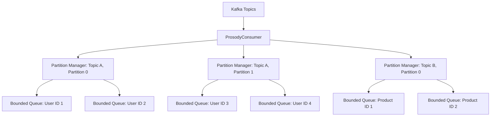
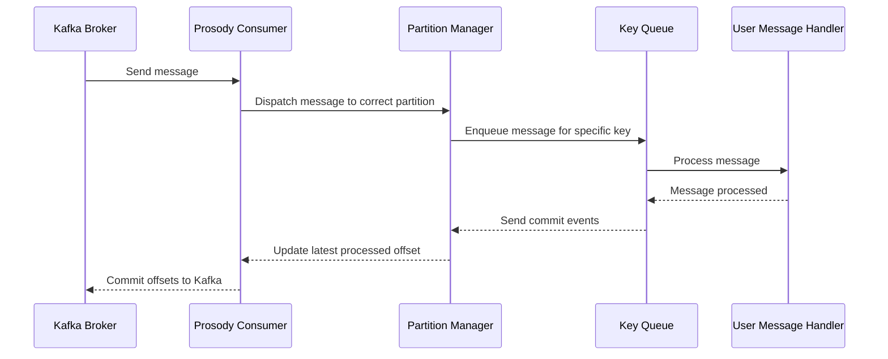

# Prosody

Prosody is a high-level Kafka client library for Rust, featuring robust consumer and producer implementations with
integrated OpenTelemetry support for distributed tracing.

[](https://prosody.docs.rg-infra.com/prosody)
[](https://github.com/cincpro/prosody/actions/workflows/general.yaml?query=branch%3Amain)
[](https://github.com/cincpro/prosody/actions/workflows/documentation.yaml?query=branch%3Amain)
[](https://github.com/cincpro/prosody/actions/workflows/quality.yaml?query=branch%3Amain)
[](https://github.com/cincpro/prosody/actions/workflows/coverage.yaml?query=branch%3Amain)


## Features

- **Kafka Consumer**: Efficiently consume messages with support for offset management and consumer groups.
- **Kafka Producer**: Reliably produce messages with idempotent delivery.
- **Distributed Tracing**: Seamless integration with OpenTelemetry for enhanced observability in microservice
  architectures.
- **Configurable**: Flexible configuration through environment variables.
- **Asynchronous**: Built on top of Tokio for high-performance asynchronous operations.
- **Backpressure Management**: Intelligent partition pausing to handle processing backlogs.
- **Mocking Support**: Ability to use mock Kafka brokers for testing purposes.
- **High-Level Client**: Unified management of producer and consumer operations.
- **Failure Handling**: Configurable strategies for handling message processing failures.

## Usage

Add Prosody to your `Cargo.toml`:

```toml
[dependencies]
prosody = { git = "https://github.com/cincpro/prosody.git" }
```

### High-Level Client Example

```rust
use prosody::consumer::ConsumerConfiguration;
use prosody::consumer::failure::retry::RetryConfiguration;
use prosody::consumer::failure::topic::FailureTopicConfigurationBuilder;
use prosody::consumer::failure::{FallibleHandler, ClassifyError};
use prosody::consumer::message::{ConsumerMessage, MessageContext};
use prosody::high_level::mode::Mode;
use prosody::high_level::{HighLevelClient};
use prosody::producer::ProducerConfiguration;
use serde_json::json;
use std::convert::Infallible;
use std::error::Error;

#[derive(Clone)]
struct MyHandler;

impl FallibleHandler for MyHandler {
    type Error = Infallible;

    async fn on_message(
        &self,
        context: MessageContext,
        message: ConsumerMessage
    ) -> Result<(), Self::Error> {
        println!("Received: {message:?}");
        Ok(())
    }
}

#[tokio::main]
async fn main() -> Result<(), Box<dyn std::error::Error>> {
    let bootstrap_servers = ["localhost:9092".to_owned()];

    let mut producer_config = ProducerConfiguration::builder();
    producer_config.bootstrap_servers(bootstrap_servers.clone());

    let mut consumer_config = ConsumerConfiguration::builder();
    consumer_config.bootstrap_servers(bootstrap_servers)
        .group_id("my-group")
        .subscribed_topics(["my-topic".to_owned()]);

    let retry_config = RetryConfiguration::builder();

    let client = HighLevelClient::new(
        Mode::Pipeline,
        &producer_config,
        &consumer_config,
        &retry_config,
        &FailureTopicConfigurationBuilder::default(),
    )?;

    client.subscribe(MyHandler)?;

    let topic = "my-topic".into();
    client.send(topic, "message-key", &json!({"value": "Hello, Kafka!"})).await?;

    // Run your application logic here

    client.unsubscribe().await?;
    Ok(())
}
```

## High-Level Client Modes

Prosody's `HighLevelClient` supports two operational modes:

### Pipeline Mode

Designed for applications that require all messages to be processed or sent in order. It ensures:

- Ordered handling of all messages
- Indefinite retries for failed operations based on the retry configuration
- Ideal for pipeline applications where order is crucial

### Low-Latency Mode

Optimized for applications prioritizing quick processing or sending, tolerating occasional message failures. It
features:

- Low-latency operations
- A retry mechanism for failed operations
- For consumers: Sends persistently failing messages to a failure topic
- For producers: Returns an error after a configurable number of retries
- Ideal for applications where speed is crucial and failed messages can be handled separately

### Best-Effort Mode

Designed for development environments or services where message processing failures are acceptable. It features:

- Simple error logging without retries
- Failed messages are logged and discarded
- For consumers: Failed messages are logged and committed
- For producers: Returns an error after configured timeout
- Ideal for:
    - Development and testing environments
    - Services that can tolerate message loss
    - Applications where retrying failed messages is not critical

## Configuration

Prosody can be configured through environment variables or programmatically using the builder pattern. Both
`ConsumerConfiguration` and `ProducerConfiguration` use this approach. The builder pattern automatically falls back to
environment variables for any unspecified field. This means you can mix and match programmatic configuration with
environment variables, giving you flexibility in how you set up your Kafka clients.

The following table lists the available configuration options and their associated environment variables:

| Environment Variable             | Description                                                                    | Default | Consumer | Producer |
|----------------------------------|--------------------------------------------------------------------------------|---------|----------|----------|
| `PROSODY_BOOTSTRAP_SERVERS`      | Comma-separated list of Kafka bootstrap servers                                | -       | ✓        | ✓        |
| `PROSODY_COMMIT_INTERVAL`        | Interval between commit operations                                             | 1s      | ✓        |          |
| `PROSODY_FAILURE_TOPIC`          | Topic for failed messages in low-latency mode                                  | -       | ✓        |          |
| `PROSODY_GROUP_ID`               | Consumer group identifier                                                      | -       | ✓        |          |
| `PROSODY_IDEMPOTENCE_CACHE_SIZE` | Size of LRU cache for tracking message IDs. Set to 0 to disable.               | 4096    | ✓        |          |
| `PROSODY_MAX_ENQUEUED_PER_KEY`   | Maximum number of enqueued messages per key (additional messages backpressure) | 8       | ✓        |          |
| `PROSODY_MAX_RETRIES`            | Maximum number of retries in low-latency mode                                  | 3       | ✓        |          |
| `PROSODY_MAX_UNCOMMITTED`        | Maximum number of uncommitted messages per partition (partition concurrency)   | 32      | ✓        |          |
| `PROSODY_MOCK`                   | Use mock Kafka brokers for testing                                             | false   | ✓        | ✓        |
| `PROSODY_POLL_INTERVAL`          | Maximum interval between poll operations                                       | 100ms   | ✓        |          |
| `PROSODY_PROBE_PORT`             | Port for the probe server (health checks). Set to 'none' to disable.           | 8000    | ✓        |          |
| `PROSODY_RETRY_BASE`             | Base retry exponential backoff delay                                           | 20ms    | ✓        |          |
| `PROSODY_RETRY_MAX_DELAY`        | Maximum retry delay                                                            | 1m      | ✓        |          |
| `PROSODY_SEND_TIMEOUT`           | Timeout for send operations in the low-latency mode producer                   | 1s      |          | ✓        |
| `PROSODY_STALL_THRESHOLD`        | Duration after which processing is considered stalled                          | 5m      | ✓        |          |
| `PROSODY_SUBSCRIBED_TOPICS`      | Comma-separated list of topics to subscribe to                                 | -       | ✓        |          |

## Idempotence and Message Deduplication

Prosody can deduplicate messages using an LRU cache that tracks message IDs per partition. When a message contains an
`id` field in its JSON payload, Prosody checks if it matches the last seen ID for that message key. If it matches, the
message is skipped as a duplicate.

Configure with `PROSODY_IDEMPOTENCE_CACHE_SIZE`:

- Default: 4096 entries per partition (~400KB memory each)
- Set to 0 to disable deduplication
- Entries are removed when the cache is full (LRU) or a key receives a message without an ID

## Liveness and Readiness Probes

Prosody includes a built-in probe server that provides health check endpoints for consumer-based applications. The probe
server is tied to the consumer's lifecycle and offers two main endpoints:

1. `/readyz`: A readiness probe that checks if any partitions are assigned to the consumer. It returns a success status
   only when the consumer has at least one partition assigned, indicating it's ready to process messages.
2. `/livez`: A liveness probe that checks if any partitions have stalled.

A partition is considered "stalled" if it has not processed a message within a specified time threshold. This threshold
is determined by the `PROSODY_STALL_THRESHOLD` configuration. By default, this is set to 5 minutes, but it
can be customized to suit your application's needs. If a partition is detected as stalled, the liveness probe will fail,
potentially triggering a restart of the application by the orchestration system.

To configure the probe server:

- Set the `PROSODY_PROBE_PORT` environment variable to a valid port number to enable the server. By default, it uses
  port 8000.
- To disable the probe server, set `PROSODY_PROBE_PORT` to 'none'.
- Adjust the `PROSODY_STALL_THRESHOLD` to change the stall detection threshold. For example, setting it to
  "30s" would consider a partition stalled if it hasn't processed a message in 30 seconds.
- If the probe server is enabled, it will start when the consumer is subscribed and stop when it is unsubscribed.

Note: It's important to set the `PROSODY_STALL_THRESHOLD` to a value that's appropriate for your application's
message processing latency. Setting it too low might result in false positives for stalled partitions, while setting it
too high could delay the detection of actual issues.

These endpoints can be integrated with container orchestration systems like Kubernetes to manage the lifecycle of your
application based on its health and readiness status. They provide valuable information about the consumer's state,
helping to ensure robust and responsive Kafka-based applications.

## Common Project Tasks

Prosody uses a Makefile to simplify common development tasks. Here are some useful commands:

### Setup

- `make bootstrap`: Install Rust and necessary development tools.
- `make up`: Start Kafka and related services using Docker Compose.

### Development

- `make update`: Update project dependencies.
- `make format`: Format Rust code and TOML files.
- `make build`: Build the project.
- `make check`: Check for compilation errors without building.
- `make check-watch`: Watch for changes and check for compilation errors.
- `make lint`: Run Clippy for linting.
- `make lint-watch`: Watch for changes and run Clippy.

### Testing

- `make test`: Run tests (starts Kafka services first).
- `make test-watch`: Watch for changes and run tests.
- `make coverage`: Generate code coverage report.

### Maintenance

- `make dependencies`: Check for unused dependencies.
- `make reset`: Stop and remove Docker containers and volumes.

### Utilities

- `make console`: Open the Kafka console in a web browser.

## Architecture

Prosody is designed to provide efficient and parallel processing of Kafka messages while maintaining order for messages
with the same key. Here's an overview of its architecture:

### Consumer Architecture

The consumer in Prosody is built around the concept of partition-level parallelism and key-based ordering.



1. **Partition-Level Parallelism**: Each Kafka partition is managed by a separate `PartitionManager`. This allows for
   parallel processing of messages from different partitions. The `PartitionManager` is responsible for buffering
   messages and tracking offsets for its assigned partition.

2. **Key-Based Queuing**: Within each partition, messages are further divided based on their keys. Each unique key
   within a partition has its own bounded queue. This ensures that messages with the same key are processed in order.

3. **Concurrent Processing**: Different keys can be processed concurrently, even within the same partition, allowing for
   high throughput. The `PartitionManager` can process messages from different key queues simultaneously.

4. **Ordered Processing**: Messages with the same key are processed sequentially from their respective queue, ensuring
   ordered processing for each key.

5. **Polling Mechanism**: The `KafkaConsumer` uses a polling mechanism to efficiently fetch messages from Kafka brokers.

6. **Partition Pausing**: If a partition becomes backed up (i.e., its queues are full), Prosody will pause consumption
   from that specific partition. Other partitions continue to make progress, ensuring that a slowdown in one partition
   doesn't affect the entire consumer.

### Message Flow



1. The `ProsodyConsumer` polls messages from Kafka Brokers.
2. Messages are dispatched to the appropriate `PartitionManager` based on their topic and partition.
3. The `PartitionManager` enqueues the message in the correct key-based queue according to the message key (e.g., User
   ID,
   Product ID).
4. Messages are processed sequentially from each key queue, invoking the user-provided `EventHandler`.
5. After processing, the latest processed offset for the key is updated.
6. The `PartitionManager` tracks the partition's high watermark committed offset.
7. The Prosody Consumer periodically commits these offsets back to Kafka, ensuring at-least-once message processing
   semantics.
8. If a partition's queues become full, that specific partition is paused until the backlog is processed.

Throughout this flow, OpenTelemetry is used to create and propagate distributed traces, allowing for end-to-end
visibility of message processing across different services.

This architecture allows Prosody to achieve high throughput by processing different partitions and keys concurrently,
while still maintaining strict ordering for messages with the same key. It also provides backpressure management by
limiting the number of in-flight messages per key and partition through bounded queues and selective partition pausing.
