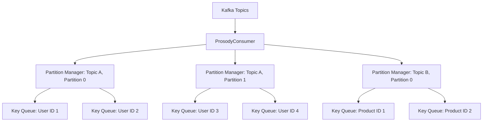
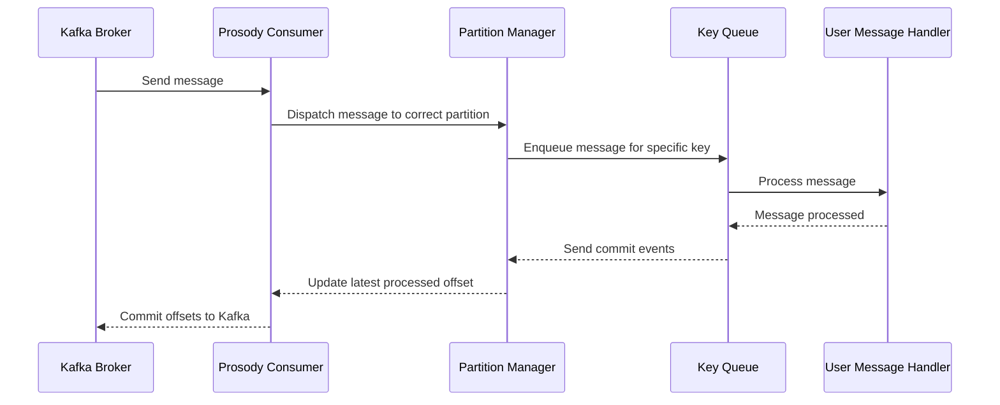

# Prosody

Prosody is a high-level Kafka client library for Rust, featuring robust consumer and producer implementations with
integrated OpenTelemetry support for distributed tracing.

[](https://studious-enigma-6k896qq.pages.github.io/prosody)
[](https://github.com/cincpro/prosody/actions/workflows/general.yaml?query=branch%3Amain)
[](https://github.com/cincpro/prosody/actions/workflows/documentation.yaml?query=branch%3Amain)
[](https://github.com/cincpro/prosody/actions/workflows/quality.yaml?query=branch%3Amain)
[](https://github.com/cincpro/prosody/actions/workflows/coverage.yaml?query=branch%3Amain)


## Features

- **Kafka Consumer**: Per-key ordering with cross-key concurrency, offset management, consumer groups.
- **Kafka Producer**: Idempotent delivery with configurable retries.
- **Timer System**: Persistent scheduled execution backed by Cassandra or in-memory store.
- **Quality of Service**: Fair scheduling limits concurrency and prevents failures from starving fresh traffic. Pipeline
  mode adds deferred retry and monopolization detection.
- **Distributed Tracing**: OpenTelemetry integration for tracing message flow across services.
- **Backpressure**: Pauses partitions when handlers fall behind.
- **Mocking**: In-memory Kafka broker for tests (`PROSODY_MOCK=true`).
- **High-Level Client**: Combines producer and consumer with timer support.
- **Failure Handling**: Pipeline (retry forever), Low-Latency (dead letter), Best-Effort (log and skip).

## Usage

Add Prosody to your `Cargo.toml`:

```toml
[dependencies]
prosody = { git = "https://github.com/cincpro/prosody.git" }
```

### High-Level Client Example

```rust
use prosody::consumer::ConsumerConfiguration;
use prosody::consumer::failure::retry::RetryConfiguration;
use prosody::consumer::failure::topic::FailureTopicConfigurationBuilder;
use prosody::consumer::failure::{FallibleHandler, ClassifyError};
use prosody::consumer::message::ConsumerMessage;
use prosody::consumer::event_context::EventContext;
use prosody::timers::{Trigger, store::TriggerStore};
use prosody::timers::store::cassandra::CassandraConfigurationBuilder;
use prosody::high_level::mode::Mode;
use prosody::high_level::{HighLevelClient};
use prosody::producer::ProducerConfiguration;
use serde_json::json;
use std::convert::Infallible;
use std::error::Error;

#[derive(Clone)]
struct MyHandler;

impl FallibleHandler for MyHandler {
    type Error = Infallible;

    async fn on_message<C>(
        &self,
        context: C,
        message: ConsumerMessage
    ) -> Result<(), Self::Error>
    where
        C: EventContext,
    {
        println!("Received: {message:?}");
        Ok(())
    }

    async fn on_timer<C>(
        &self,
        context: C,
        trigger: Trigger,
    ) -> Result<(), Self::Error>
    where
        C: EventContext,
    {
        println!("Timer triggered: {trigger:?}");
        Ok(())
    }
}

#[tokio::main]
async fn main() -> Result<(), Box<dyn std::error::Error>> {
    let bootstrap_servers = ["localhost:9092".to_owned()];

    // The group identifier is the name of your Kafka consumer group. It should be set to the name of your application.
    let mut consumer_config = ConsumerConfiguration::builder();
    consumer_config.bootstrap_servers(bootstrap_servers)
        .group_id("my-group")
        .subscribed_topics(["my-topic".to_owned()]);


    // To allow loopbacks, the source_system must be different from the group_id.
    // Normally, the source_system would be left unspecified and would default to the group_id if a consumer is 
    // configured.
    let mut producer_config = ProducerConfiguration::builder();
    producer_config
        .bootstrap_servers(bootstrap_servers.clone())
        .source_system("my-source");

    let retry_config = RetryConfiguration::builder();
    let cassandra_config = CassandraConfigurationBuilder::default();

    let client = HighLevelClient::new(
        Mode::Pipeline,
        &mut producer_config,
        &consumer_config,
        &retry_config,
        &FailureTopicConfigurationBuilder::default(),
        &cassandra_config,
    )?;

    client.subscribe(MyHandler).await?;

    let topic = "my-topic".into();
    client.send(topic, "message-key", &json!({"value": "Hello, Kafka!"})).await?;

    // Run your application logic here

    client.unsubscribe().await?;
    Ok(())
}
```

## Quality of Service

All modes use **fair scheduling** to limit concurrency and distribute execution time. Pipeline mode adds **deferred
retry** and **monopolization detection**.

### Fair Scheduling (All Modes)

The scheduler controls which message runs next and how many run concurrently.

**Virtual Time (VT):** Each key accumulates VT equal to its handler execution time. The scheduler picks the key with the
lowest VT. A key that runs for 500ms accumulates 500ms of VT; a key that hasn't run recently has zero VT and gets
priority.

**Two-Class Split:** Normal messages and failure retries have separate VT pools. The scheduler allocates execution time
between them (default: 70% normal, 30% failure). During a failure spike, retries get at most 30% of execution time—fresh
messages continue processing.

**Starvation Prevention:** Tasks receive a quadratic priority boost based on wait time. A task waiting 2 minutes
(configurable) gets maximum boost, overriding VT disadvantage.

**Decay:** VT decays exponentially (120s half-life). A key that monopolized 10 minutes ago has negligible penalty now.

### Deferred Retry (Pipeline Mode)

Moves failing keys to timer-based retry so the partition can continue processing other keys.

On transient failure: store the message offset in Cassandra, schedule a timer, return success. The partition advances.
When the timer fires, reload the message from Kafka and retry.

**Failure Rate Gating:** When >90% of recent messages fail, deferral disables. The retry middleware blocks the
partition, applying backpressure.

### Monopolization Detection (Pipeline Mode)

Rejects keys that consume too much execution time.

The middleware tracks per-key execution time in 5-minute rolling windows. Keys exceeding 90% of window time are rejected
with a transient error, routing them through defer.

## High-Level Client Modes

### Pipeline Mode

All messages must be processed. Retries indefinitely. Uses defer and monopolization detection.

```
Kafka → Retry → Deduplication → Defer → Monopolization → Shutdown → Scheduler → Timeout → Telemetry → Handler
```

| Layer          | Purpose                                                  |
|----------------|----------------------------------------------------------|
| Retry          | Retries transient errors indefinitely                    |
| Deduplication  | Filters duplicate messages via local cache + Cassandra   |
| Defer          | Stores failing messages for timer-based retry            |
| Monopolization | Rejects keys exceeding execution time threshold          |
| Shutdown       | Drains in-flight work on partition revocation            |
| Scheduler      | Enforces concurrency limits and VT-based priority        |
| Timeout        | Cancels handlers exceeding deadline                      |
| Telemetry      | Emits handler lifecycle events                           |

### Low-Latency Mode

Tries a few times, then routes failures to a dead letter topic.

- Retries up to `PROSODY_MAX_RETRIES` times, then writes to failure topic
- Fair scheduling limits how much time retries consume
- Use when you need to keep moving and can reprocess failures later

### Best-Effort Mode

Logs failures and moves on.

- No retries; failed messages are logged and committed
- Fair scheduling still enforces concurrency limits
- Use for development or when message loss is acceptable

## Configuration

Configure via environment variables or the builder pattern. Builders fall back to environment variables for unset
fields, so you can mix both approaches.

### Core

| Environment Variable        | Description                                        | Default      | Consumer | Producer |
|-----------------------------|----------------------------------------------------|--------------|----------|----------|
| `PROSODY_BOOTSTRAP_SERVERS` | Kafka servers to connect to                        | -            | ✓        | ✓        |
| `PROSODY_GROUP_ID`          | Consumer group name                                | -            | ✓        |          |
| `PROSODY_SUBSCRIBED_TOPICS` | Topics to read from                                | -            | ✓        |          |
| `PROSODY_ALLOWED_EVENTS`    | Only process events matching these prefixes        | (all)        | ✓        |          |
| `PROSODY_SOURCE_SYSTEM`     | Tag for outgoing messages (prevents reprocessing)  | `<group id>` |          | ✓        |
| `PROSODY_MOCK`              | Use in-memory Kafka for testing                    | false        | ✓        | ✓        |
| `PROSODY_LOG`               | Log level (e.g., `info`, `prosody=debug`)          | info         | ✓        | ✓        |

### Consumer

| Environment Variable             | Description                                          | Default                |
|----------------------------------|------------------------------------------------------|------------------------|
| `PROSODY_MAX_CONCURRENCY`        | Max messages being processed simultaneously          | 32                     |
| `PROSODY_MAX_UNCOMMITTED`        | Max queued messages before pausing consumption       | 64                     |
| `PROSODY_TIMEOUT`                | Cancel handler if it runs longer than this           | 80% of stall threshold |
| `PROSODY_COMMIT_INTERVAL`        | How often to save progress to Kafka                  | 1s                     |
| `PROSODY_POLL_INTERVAL`          | How often to fetch new messages from Kafka           | 100ms                  |
| `PROSODY_SHUTDOWN_TIMEOUT`       | Wait this long for in-flight work before force-quit  | 30s                    |
| `PROSODY_STALL_THRESHOLD`        | Report unhealthy if no progress for this long        | 5m                     |
| `PROSODY_PROBE_PORT`             | HTTP port for health checks ('none' to disable)      | 8000                   |
| `PROSODY_FAILURE_TOPIC`          | Send unprocessable messages here (dead letter queue) | -                      |
| `PROSODY_SLAB_SIZE`              | Timer storage granularity (rarely needs changing)    | 1h                     |

### Producer

| Environment Variable   | Description                     | Default |
|------------------------|---------------------------------|---------|
| `PROSODY_SEND_TIMEOUT` | Give up sending after this long | 1s      |

### Retry

When a handler fails, retry with exponential backoff:

| Environment Variable      | Description                      | Default |
|---------------------------|----------------------------------|---------|
| `PROSODY_MAX_RETRIES`     | Give up after this many attempts | 3       |
| `PROSODY_RETRY_BASE`      | Wait this long before first retry | 20ms    |
| `PROSODY_RETRY_MAX_DELAY` | Never wait longer than this      | 5m      |

### Deferral (Pipeline Mode)

| Environment Variable              | Description                                       | Default |
|-----------------------------------|---------------------------------------------------|---------|
| `PROSODY_DEFER_ENABLED`           | Enable deferral for new messages                  | true    |
| `PROSODY_DEFER_BASE`              | Wait this long before first deferred retry        | 1s      |
| `PROSODY_DEFER_MAX_DELAY`         | Never wait longer than this                       | 24h     |
| `PROSODY_DEFER_FAILURE_THRESHOLD` | Disable deferral when failure rate exceeds this   | 0.9     |
| `PROSODY_DEFER_FAILURE_WINDOW`    | Measure failure rate over this time window        | 5m      |
| `PROSODY_DEFER_CACHE_SIZE`        | Track this many deferred keys in memory           | 1024    |
| `PROSODY_DEFER_SEEK_TIMEOUT`      | Timeout when loading deferred messages            | 30s     |
| `PROSODY_DEFER_DISCARD_THRESHOLD` | Read optimization (rarely needs changing)         | 100     |

### Deduplication (Pipeline Mode)

| Environment Variable             | Description                                         | Default |
|----------------------------------|-----------------------------------------------------|---------|
| `PROSODY_IDEMPOTENCE_CACHE_SIZE` | Per-partition local cache capacity (0 to disable)   | 4096    |
| `PROSODY_IDEMPOTENCE_VERSION`    | Version string for cache-busting dedup hashes       | 1       |
| `PROSODY_IDEMPOTENCE_TTL`        | TTL for dedup records in Cassandra                  | 7d      |

### Cassandra

Persistent storage for scheduled retries and deduplication (not needed if `PROSODY_MOCK=true`):

| Environment Variable           | Description                        | Default |
|--------------------------------|------------------------------------|---------|
| `PROSODY_CASSANDRA_NODES`      | Servers to connect to (host:port)  | -       |
| `PROSODY_CASSANDRA_KEYSPACE`   | Keyspace name                      | prosody |
| `PROSODY_CASSANDRA_USER`       | Username                           | -       |
| `PROSODY_CASSANDRA_PASSWORD`   | Password                           | -       |
| `PROSODY_CASSANDRA_DATACENTER` | Prefer this datacenter for queries | -       |
| `PROSODY_CASSANDRA_RACK`       | Prefer this rack for queries       | -       |
| `PROSODY_CASSANDRA_RETENTION`  | Delete data older than this        | 1y      |

### Telemetry Emitter

Publishes message and timer lifecycle events to a Kafka topic:

| Environment Variable        | Description                                | Default                  |
|-----------------------------|--------------------------------------------|--------------------------|
| `PROSODY_TELEMETRY_ENABLED` | Enable the telemetry event emitter         | true                     |
| `PROSODY_TELEMETRY_TOPIC`   | Kafka topic to publish telemetry events to | prosody.telemetry-events |

### Monopolization Detection (Pipeline Mode)

| Environment Variable                | Description                            | Default |
|-------------------------------------|----------------------------------------|---------|
| `PROSODY_MONOPOLIZATION_ENABLED`    | Enable hot key protection              | true    |
| `PROSODY_MONOPOLIZATION_THRESHOLD`  | Max handler time as fraction of window | 0.9     |
| `PROSODY_MONOPOLIZATION_WINDOW`     | Measurement window                     | 5m      |
| `PROSODY_MONOPOLIZATION_CACHE_SIZE` | Max distinct keys to track             | 8192    |

### Fair Scheduling (All Modes)

| Environment Variable               | Description                                                      | Default |
|------------------------------------|------------------------------------------------------------------|---------|
| `PROSODY_SCHEDULER_FAILURE_WEIGHT` | Fraction of processing time reserved for retries                 | 0.3     |
| `PROSODY_SCHEDULER_MAX_WAIT`       | Messages waiting this long get maximum priority                  | 2m      |
| `PROSODY_SCHEDULER_WAIT_WEIGHT`    | Priority boost for waiting messages (higher = more aggressive)   | 200.0   |
| `PROSODY_SCHEDULER_CACHE_SIZE`     | Max distinct keys to track                                       | 8192    |

### Topic Creation

For creating Kafka topics programmatically:

| Environment Variable               | Description                            | Default         |
|------------------------------------|----------------------------------------|-----------------|
| `PROSODY_TOPIC_NAME`               | Topic to create                        | -               |
| `PROSODY_TOPIC_PARTITIONS`         | Number of partitions                   | broker default  |
| `PROSODY_TOPIC_REPLICATION_FACTOR` | Number of replicas per partition       | broker default  |
| `PROSODY_TOPIC_RETENTION`          | Delete messages older than this        | cluster default |
| `PROSODY_TOPIC_CLEANUP_POLICY`     | Cleanup policy (delete, compact, both) | cluster default |

## Mock Mode for Testing

Prosody includes a mock mode that allows you to test your application without requiring a real Kafka cluster. This is
particularly useful for unit tests, integration tests, and local development.

### Enabling Mock Mode

To enable mock mode, set the `PROSODY_MOCK` environment variable to `true` or configure it programmatically. When using
mock mode, Prosody automatically creates topics in the mock cluster based on the `PROSODY_SUBSCRIBED_TOPICS` environment
variable. This ensures that consumers can subscribe to any topics they need without encountering "topic does not exist"
errors.

### Mock Mode Behavior

In mock mode:

- **Kafka Brokers**: Uses an in-memory mock Kafka cluster instead of real brokers
- **Timer Storage**: Uses in-memory storage instead of Cassandra
- **Topic Creation**: Automatically creates topics listed in `PROSODY_SUBSCRIBED_TOPICS`
- **Message Processing**: Full message processing pipeline works as in production
- **Networking**: No external network dependencies required

## Event Type Filtering

Prosody supports filtering messages based on exact event type prefixes, configured via `PROSODY_ALLOWED_EVENTS` or the
`ConsumerConfiguration` builder.

### Configuration

```sh
# Allow only events starting with exactly 'user.' or 'account.'
export PROSODY_ALLOWED_EVENTS=user.,account.
```

```rust,ignore
let config = ConsumerConfiguration::builder()
    .allowed_events(vec!["user.".to_owned()])
    .build()?;
```

### Matching Behavior

Prefixes must match exactly from the start of the event type:

✓ Matches:

- `{"type": "user.created"}` matches prefix `user.`
- `{"type": "account.deleted"}` matches prefix `account.`

✗ No Match:

- `{"type": "admin.user.created"}` doesn't match `user.`
- `{"type": "my.account.deleted"}` doesn't match `account.`
- `{"type": "notification"}` doesn't match any prefix

If no prefixes are configured, all messages are processed. Messages without a `type` field are always processed.

## Message Deduplication

Prosody prevents duplicate message processing using two mechanisms: **source system deduplication** and **idempotence
deduplication**.

### Source System Deduplication

Prosody introduces the `source-system` header to prevent processing loops caused by messages being reprocessed by the
same system that produced them:

- **Producers** add a `source-system` header to all outgoing messages.
- **Consumers** check incoming messages for the `source-system` header.
- If a message's `source-system` header matches the consumer group, the message is skipped.

This ensures that messages re-emitted by a consumer (e.g., for retry or forwarding purposes) do not create infinite
processing loops. If your application is doing both consumption and production, the source system will default to your
consumer group identifier. If your application is only producing messages and never configures a consumer, you will need
to set the source system. To explicitly set the producer's source system identifier, configure:

```sh
export PROSODY_SOURCE_SYSTEM="my-service"
```

### Idempotence Deduplication (Pipeline Mode)

The pipeline consumer includes a deduplication middleware that filters duplicate messages using a two-tier cache:

1. **Local cache**: A per-partition in-memory LRU cache for fast lookups.
2. **Persistent store**: A Cassandra-backed store that survives restarts and rebalances.

When a message arrives, the middleware computes a deterministic UUID by hashing the version, consumer group, topic,
partition, key, and either the message's `id` field or its Kafka offset. It checks the local cache first, then
Cassandra. If found in either, the message is skipped. Otherwise, the message is processed and the UUID is recorded in
both tiers.

- **Best-effort persistence**: Cassandra read failures are treated as cache misses; write failures are logged but do not
  fail the message. The local cache still provides deduplication within a single process lifetime.
- **Cache-busting**: Changing `PROSODY_IDEMPOTENCE_VERSION` invalidates all previously recorded entries, causing
  messages to be reprocessed.
- **TTL expiry**: Dedup records in Cassandra expire after `PROSODY_IDEMPOTENCE_TTL` (default: 7 days).
- **Disabling**: Set `PROSODY_IDEMPOTENCE_CACHE_SIZE` to `0` to disable the middleware entirely.

The producer also maintains a separate local deduplication cache to avoid sending duplicate messages. It hashes the
`(topic, key, id)` triple into a 128-bit key and stores it in a bounded in-memory set. Messages without an `id` field
bypass the cache entirely. Once a triple is seen, it stays in the cache until evicted by capacity.

## Liveness and Readiness Probes

Prosody includes a built-in probe server that provides health check endpoints for consumer-based applications. The probe
server is tied to the consumer's lifecycle and offers two main endpoints:

1. `/readyz`: A readiness probe that checks if any partitions are assigned to the consumer. It returns a success status
   only when the consumer has at least one partition assigned, indicating it's ready to process messages.
2. `/livez`: A liveness probe that checks if any partitions have stalled.

A partition is considered "stalled" if it has not processed a message within a specified time threshold. This threshold
is determined by the `PROSODY_STALL_THRESHOLD` configuration. By default, this is set to 5 minutes, but it
can be customized to suit your application's needs. If a partition is detected as stalled, the liveness probe will fail,
potentially triggering a restart of the application by the orchestration system.

To configure the probe server:

- Set the `PROSODY_PROBE_PORT` environment variable to a valid port number to enable the server. By default, it uses
  port 8000.
- To disable the probe server, set `PROSODY_PROBE_PORT` to 'none'.
- Adjust the `PROSODY_STALL_THRESHOLD` to change the stall detection threshold. For example, setting it to
  "30s" would consider a partition stalled if it hasn't processed a message in 30 seconds.
- If the probe server is enabled, it will start when the consumer is subscribed and stop when it is unsubscribed.

Note: It's important to set the `PROSODY_STALL_THRESHOLD` to a value that's appropriate for your application's
message processing latency. Setting it too low might result in false positives for stalled partitions, while setting it
too high could delay the detection of actual issues.

These endpoints can be integrated with container orchestration systems like Kubernetes to manage the lifecycle of your
application based on its health and readiness status. They provide valuable information about the consumer's state,
helping to ensure robust and responsive Kafka-based applications.

## Timer System

Prosody includes a distributed timer system that allows you to schedule events for future execution. The timer system
supports:

- **Persistent Storage**: Timers are stored in persistent backends (Cassandra or in-memory for testing)
- **Distributed Processing**: Multiple consumer instances can process timers from the same storage
- **Slab-Based Partitioning**: Timers are organized into time-based slabs for efficient retrieval
- **Automatic Cleanup**: Successfully processed timers are immediately deleted; failed timers expire after configurable
  period

### Timer Configuration

The timer system is automatically configured based on the consumer configuration:

- **Mock Mode**: Uses in-memory storage for testing (`PROSODY_MOCK=true`)
- **Production Mode**: Uses Cassandra for persistent storage
- **Slab Size**: Configure time-based partitioning with `PROSODY_SLAB_SIZE` (default: 1 hour)
- **Retention**: Retention period for timer and failure data via `PROSODY_CASSANDRA_RETENTION` (default: 1 year)

### Usage in Handlers

Your event handlers can receive timer events through the `on_timer` method of the `FallibleHandler` trait, as shown in
the example above.

## Common Project Tasks

Prosody uses a Makefile to simplify common development tasks. Here are some useful commands:

### Setup

- `make bootstrap`: Install Rust and necessary development tools.
- `make up`: Start Kafka and related services using Docker Compose.

### Development

- `make update`: Update project dependencies.
- `make format`: Format Rust code and TOML files.
- `make build`: Build the project.
- `make check`: Check for compilation errors without building.
- `make check-watch`: Watch for changes and check for compilation errors.
- `make lint`: Run Clippy for linting.
- `make lint-watch`: Watch for changes and run Clippy.

### Testing

- `make test`: Run tests (starts Kafka services first).
- `make test-watch`: Watch for changes and run tests.
- `make coverage`: Generate code coverage report.

### Maintenance

- `make dependencies`: Check for unused dependencies.
- `make reset`: Stop and remove Docker containers and volumes.

### Utilities

- `make console`: Open the Kafka console in a web browser.

## Architecture

Prosody is designed to provide efficient and parallel processing of Kafka messages while maintaining order for messages
with the same key. Here's an overview of its architecture:

### Consumer Architecture

The consumer in Prosody is built around the concept of partition-level parallelism and key-based ordering.



1. **Partition-Level Parallelism**: Each Kafka partition is managed by a separate `PartitionManager`. This allows for
   parallel processing of messages from different partitions. The `PartitionManager` is responsible for buffering
   messages and tracking offsets for its assigned partition.

2. **Key-Based Queuing**: Within each partition, messages are further divided based on their keys. Each unique key
   within a partition has its own queue. This ensures that messages with the same key are processed in order.

3. **Concurrent Processing**: Different keys can be processed concurrently, even within the same partition, allowing for
   high throughput. The `PartitionManager` can process messages from different key queues simultaneously.

4. **Ordered Processing**: Messages with the same key are processed sequentially from their respective queue, ensuring
   ordered processing for each key.

5. **Polling Mechanism**: The `KafkaConsumer` uses a polling mechanism to efficiently fetch messages from Kafka brokers.

6. **Backpressure Management**: Prosody provides multiple levels of backpressure control:
    - **Global buffering**: A global semaphore limits the total number of messages being processed across all partitions
    - **Partition pausing**: If a partition becomes backed up (i.e., its queues are full), Prosody will pause
      consumption
      from that specific partition. Other partitions continue to make progress, ensuring that a slowdown in one
      partition
      doesn't affect the entire consumer
    - **Per-key queuing**: Each key has its own queue to preserve message order; the global semaphore prevents unbounded growth by pausing consumption when the in-flight count reaches `PROSODY_MAX_UNCOMMITTED`

### Message Flow



1. The `ProsodyConsumer` polls messages from Kafka Brokers.
2. Messages are dispatched to the appropriate `PartitionManager` based on their topic and partition.
3. The `PartitionManager` enqueues the message in the correct key-based queue according to the message key (e.g., User
   ID,
   Product ID).
4. Messages are processed sequentially from each key queue, invoking the user-provided `EventHandler`.
5. After processing, the latest processed offset for the key is updated.
6. The `PartitionManager` tracks the partition's high watermark committed offset.
7. The Prosody Consumer periodically commits these offsets back to Kafka, ensuring at-least-once message processing
   semantics.
8. If a partition's queues become full, that specific partition is paused until the backlog is processed.

Throughout this flow, OpenTelemetry is used to create and propagate distributed traces, allowing for end-to-end
visibility of message processing across different services.

This architecture allows Prosody to achieve high throughput by processing different partitions and keys concurrently,
while still maintaining strict ordering for messages with the same key. It also provides backpressure management by
limiting the total number of in-flight messages across all keys within a partition through a global semaphore and selective partition pausing.

### Component Organization

```mermaid
flowchart TD
    classDef subgraphStyle fill:#f5f5f5,stroke:#666

    HLC["<a href='https://github.com/cincpro/prosody/tree/main/src/high_level/mod.rs'>HighLevelClient</a>"]
    HLC --> Producer["<a href='https://github.com/cincpro/prosody/tree/main/src/producer/mod.rs'>ProsodyProducer</a>"]
    HLC --> ConsumerMain["<a href='https://github.com/cincpro/prosody/tree/main/src/consumer/mod.rs'>ProsodyConsumer</a>"]

    subgraph ProducerComponents["Producer Components"]
        Producer --> KafkaProducer["<a href='https://github.com/cincpro/prosody/tree/main/src/producer/mod.rs'>Kafka Producer</a>"]
        Producer --> ICache["<a href='https://github.com/cincpro/prosody/tree/main/src/deduplication.rs'>Idempotence Cache</a>"]
        Producer --> PropP["<a href='https://github.com/cincpro/prosody/tree/main/src/propagator.rs'>OpenTelemetry Propagator</a>"]
    end

    subgraph ConsumerComponents["Consumer Components"]
        ConsumerMain --> Context["<a href='https://github.com/cincpro/prosody/tree/main/src/consumer/kafka_context.rs'>ConsumerContext</a>"]
        ConsumerMain --> PollLoop["<a href='https://github.com/cincpro/prosody/tree/main/src/consumer/poll.rs'>Poll Loop</a>"]
        ConsumerMain --> ProbeServer["<a href='https://github.com/cincpro/prosody/tree/main/src/consumer/probes.rs'>Probe Server</a>"]
        Context --> PMgr
        PollLoop --> PMgr
    end

    subgraph PartitionComponents["Partition Processing"]
        PMgr["<a href='https://github.com/cincpro/prosody/tree/main/src/consumer/partition/mod.rs'>Partition Manager</a>"]
        PMgr --> KeyMgr["<a href='https://github.com/cincpro/prosody/tree/main/src/consumer/partition/keyed/mod.rs'>Key Manager</a>"]
        PMgr --> OTracker["<a href='https://github.com/cincpro/prosody/tree/main/src/consumer/partition/offsets/mod.rs'>Offset Tracker</a>"]
        KeyMgr --> EHandler["Event Handler"]
        OTracker --> WTracker["<a href='https://github.com/cincpro/prosody/tree/main/src/consumer/partition/offsets/mod.rs'>Watermark Tracker</a>"]
    end

    subgraph MiddlewareHandling["Middleware Components"]
        RetryS["<a href='https://github.com/cincpro/prosody/tree/main/src/consumer/middleware/retry.rs'>Retry Middleware</a>"]
        DedupS["<a href='https://github.com/cincpro/prosody/tree/main/src/consumer/middleware/deduplication/mod.rs'>Deduplication Middleware</a>"]
        DeferS["<a href='https://github.com/cincpro/prosody/tree/main/src/consumer/middleware/defer/mod.rs'>Defer Middleware</a>"]
        MonoS["<a href='https://github.com/cincpro/prosody/tree/main/src/consumer/middleware/monopolization.rs'>Monopolization Middleware</a>"]
        SchedS["<a href='https://github.com/cincpro/prosody/tree/main/src/consumer/middleware/scheduler/mod.rs'>Scheduler Middleware</a>"]
        TelS["<a href='https://github.com/cincpro/prosody/tree/main/src/consumer/middleware/telemetry.rs'>Telemetry Middleware</a>"]
        LogS["<a href='https://github.com/cincpro/prosody/tree/main/src/consumer/middleware/log.rs'>Log Middleware</a>"]
        ShutdownS["<a href='https://github.com/cincpro/prosody/tree/main/src/consumer/middleware/shutdown.rs'>Shutdown Middleware</a>"]
        TopicS["<a href='https://github.com/cincpro/prosody/tree/main/src/consumer/middleware/topic.rs'>Failure Topic Middleware</a>"]
    end

    KeyMgr -.-> MiddlewareHandling
    TopicS --> FTopic["Failure Topic"]
    Producer --> FTopic

    subgraph TracingSystem["OpenTelemetry Integration"]
        OTel["<a href='https://github.com/cincpro/prosody/tree/main/src/telemetry/mod.rs'>Telemetry</a>"]
        Prop["<a href='https://github.com/cincpro/prosody/tree/main/src/propagator.rs'>Propagator</a>"]
        MExtract["<a href='https://github.com/cincpro/prosody/tree/main/src/consumer/extractor.rs'>Message Extractor</a>"]
        RInject["<a href='https://github.com/cincpro/prosody/tree/main/src/producer/injector.rs'>Record Injector</a>"]
        OTel --> Prop
        Prop --> MExtract
        Prop --> RInject
    end

    ConsumerMain -.-> OTel
    Producer -.-> OTel

    class ProducerComponents,ConsumerComponents,PartitionComponents,MiddlewareHandling,TracingSystem subgraphStyle
```


