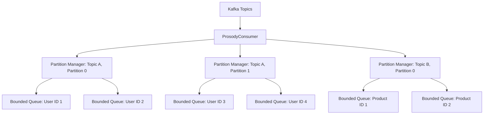
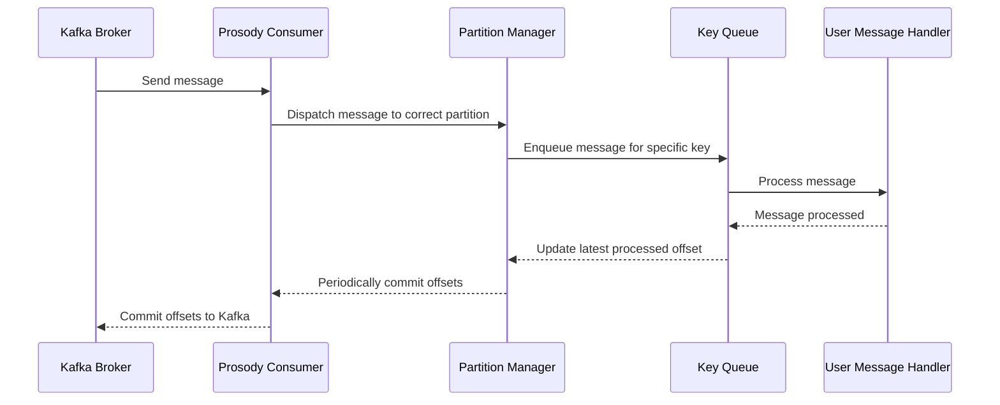

# Prosody

Prosody is a high-level Kafka client library for Rust, featuring robust consumer and producer implementations with
integrated OpenTelemetry support for distributed tracing.

## Features

- **Kafka Consumer**: Efficiently consume messages with support for offset management and consumer groups.
- **Kafka Producer**: Reliably produce messages with idempotent delivery.
- **Distributed Tracing**: Seamless integration with OpenTelemetry for enhanced observability in microservice
  architectures.
- **Configurable**: Flexible configuration through environment variables.
- **Asynchronous**: Built on top of Tokio for high-performance asynchronous operations.
- **Backpressure Management**: Intelligent partition pausing to handle processing backlogs.
- **Mocking Support**: Ability to use mock Kafka brokers for testing purposes.

## Usage

Add Prosody to your `Cargo.toml`:

```toml
[dependencies]
prosody = { git = "https://github.com/RealGeeks/prosody.git" }
```

### Producer Example

```rust
use prosody::Topic;
use prosody::producer::{ProducerConfiguration, Prosody};
use serde_json::json;
use std::error::Error;

#[tokio::main]
async fn main() -> Result<(), Box<dyn Error>> {
    let config = ProducerConfiguration::builder()
        .bootstrap_servers(["localhost:9092".to_owned()])
        .build()?;

    let producer = ProsodyProducer::new(&config)?;

    let topic: Topic = "my-topic".into();
    producer.send(topic, "message-key", json!({"value": "Hello, Kafka!"})).await?;

    Ok(())
}
```

### Consumer Example

```rust
use prosody::consumer::message::{ConsumerMessage, MessageContext};
use prosody::consumer::{ConsumerConfiguration, ProsodyConsumer, MessageHandler};
use prosody::Topic;
use std::time::Duration;
use std::error::Error;

#[derive(Clone)]
struct MyMessageHandler;

impl MessageHandler for MyMessageHandler {
    type Error = std::io::Error;

    async fn handle(
        &self,
        context: &mut MessageContext,
        message: ConsumerMessage,
    ) -> Result<(), Self::Error> {
        println!("Received: {:?}", message);
        message.commit();
        Ok(())
    }
}

#[tokio::main]
async fn main() -> Result<(), Box<dyn Error>> {
    let config = ConsumerConfiguration::builder()
        .bootstrap_servers(["localhost:9092".to_owned()])
        .group_id("my-group")
        .subscribed_topics(["my-topic".to_owned()])
        .build()?;

    let consumer = ProsodyConsumer::new(config, MyMessageHandler)?;

    // Run your application logic here

    consumer.shutdown().await;
    Ok(())
}
```

## Configuration

Prosody can be configured through environment variables or programmatically using the builder pattern. Both
`ConsumerConfiguration` and `ProducerConfiguration` use this approach. The builder pattern automatically falls back to
environment variables for any unspecified field. This means you can mix and match programmatic configuration with
environment variables, giving you flexibility in how you set up your Kafka clients.

The following table lists the available configuration options and their associated environment variables:

| Environment Variable                 | Description                                     | Default | Consumer | Producer |
|--------------------------------------|-------------------------------------------------|---------|----------|----------|
| `PROSODY_BOOTSTRAP_SERVERS`          | Comma-separated list of Kafka bootstrap servers | -       | ✓        | ✓        |
| `PROSODY_GROUP_ID`                   | Consumer group ID                               | -       | ✓        |          |
| `PROSODY_SUBSCRIBED_TOPICS`          | Comma-separated list of topics to subscribe to  | -       | ✓        |          |
| `PROSODY_MAX_UNCOMMITTED`            | Maximum number of uncommitted messages          | 32      | ✓        |          |
| `PROSODY_MAX_ENQUEUED_PER_KEY`       | Maximum number of enqueued messages per key     | 8       | ✓        |          |
| `PROSODY_PARTITION_SHUTDOWN_TIMEOUT` | Timeout for partition shutdown                  | 5s      | ✓        |          |
| `PROSODY_POLL_INTERVAL`              | Interval between poll operations                | 100ms   | ✓        |          |
| `PROSODY_COMMIT_INTERVAL`            | Interval between commit operations              | 1s      | ✓        |          |
| `PROSODY_SEND_TIMEOUT`               | Timeout for send operations in the producer     | 1s      |          | ✓        |
| `PROSODY_MOCK`                       | Use mock Kafka brokers for testing              | false   | ✓        | ✓        |

## Architecture

Prosody is designed to provide efficient and parallel processing of Kafka messages while maintaining order for messages
with the same key. Here's an overview of its architecture:

### Consumer Architecture

The consumer in Prosody is built around the concept of partition-level parallelism and key-based ordering.



1. **Partition-Level Parallelism**: Each Kafka partition is managed by a separate `PartitionManager`. This allows for
   parallel processing of messages from different partitions. The `PartitionManager` is responsible for buffering
   messages and tracking offsets for its assigned partition.

2. **Key-Based Queuing**: Within each partition, messages are further divided based on their keys. Each unique key
   within a partition has its own bounded queue. This ensures that messages with the same key are processed in order.

3. **Concurrent Processing**: Different keys can be processed concurrently, even within the same partition, allowing for
   high throughput. The `PartitionManager` can process messages from different key queues simultaneously.

4. **Ordered Processing**: Messages with the same key are processed sequentially from their respective queue, ensuring
   ordered processing for each key.

5. **Polling Mechanism**: The `KafkaConsumer` uses a polling mechanism to efficiently fetch messages from Kafka brokers.

6. **Partition Pausing**: If a partition becomes backed up (i.e., its queues are full), Prosody will pause consumption
   from that specific partition. Other partitions continue to make progress, ensuring that a slowdown in one partition
   doesn't affect the entire consumer.

### Message Flow



1. The `ProsodyConsumer` polls messages from Kafka Brokers.
2. Messages are dispatched to the appropriate `PartitionManager` based on their topic and partition.
3. The `PartitionManager` enqueues the message in the correct key-based queue according to the message key (e.g., User
   ID,
   Product ID).
4. Messages are processed sequentially from each key queue, invoking the user-provided `MessageHandler`.
5. After processing, the latest processed offset for the key is updated.
6. Periodically, the `PartitionManager` collects the latest processed offsets from all its key queues.
7. The Prosody Consumer commits these offsets back to Kafka, ensuring at-least-once message processing semantics.
8. If a partition's queues become full, that specific partition is paused until the backlog is processed.

Throughout this flow, OpenTelemetry is used to create and propagate distributed traces, allowing for end-to-end
visibility of message processing across different services.

This architecture allows Prosody to achieve high throughput by processing different partitions and keys concurrently,
while still maintaining strict ordering for messages with the same key. It also provides backpressure management by
limiting the number of in-flight messages per key and partition through bounded queues and selective partition pausing.
